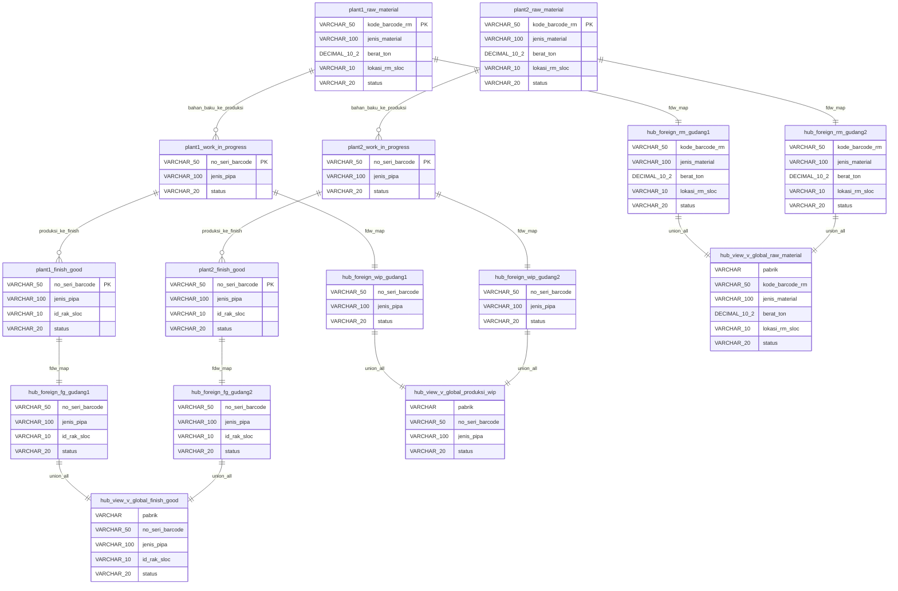
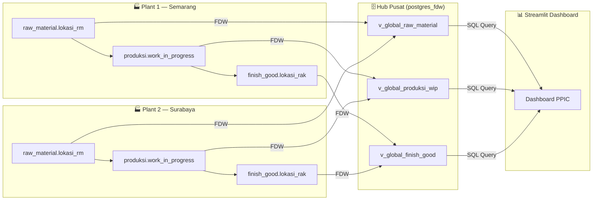
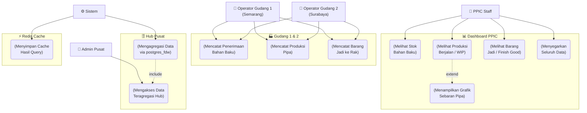
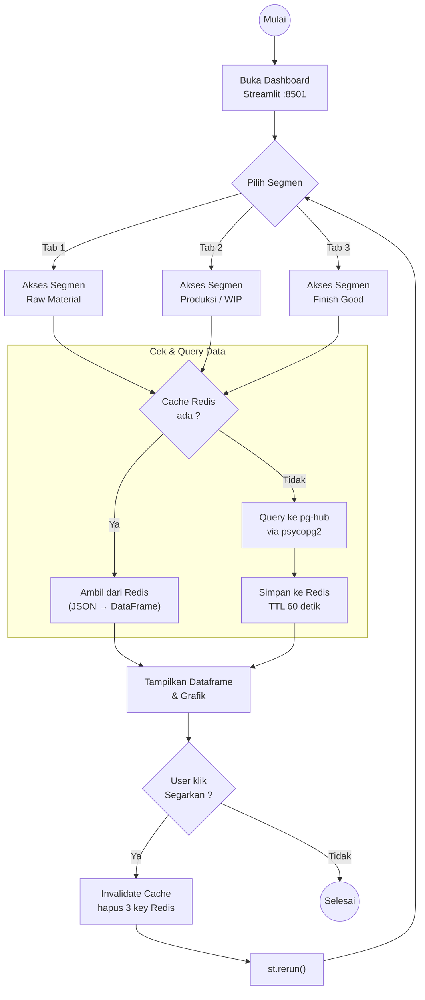
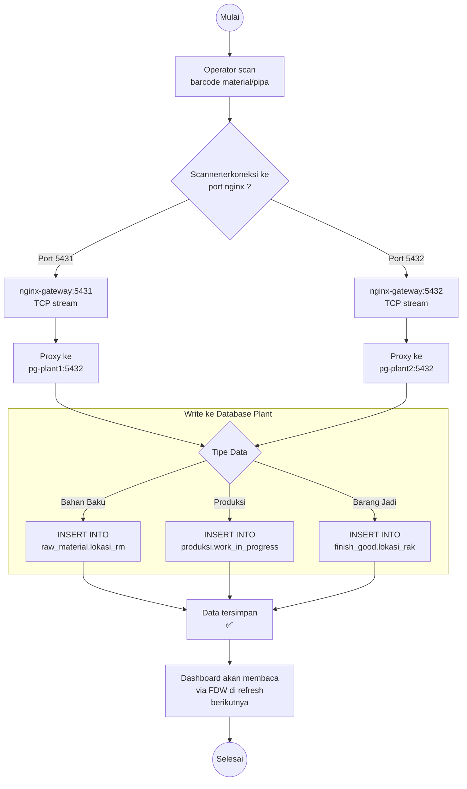
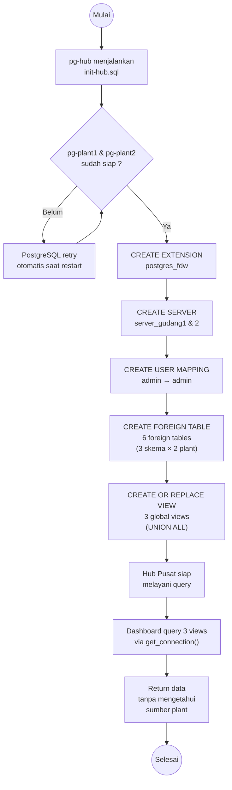
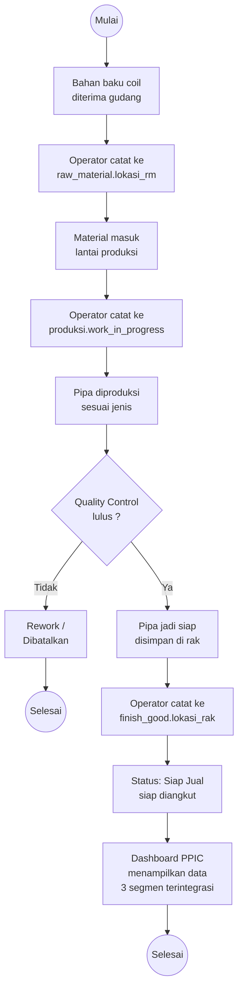

# Entity Relationship & Use Case Diagram — DWMS Pipa Baja

## Pipeline Flow

## Use Case Diagram

## Activity Diagrams

### 1. Alur Monitoring Dashboard oleh PPIC Staff

### 2. Alur Pencatatan Data oleh Operator Gudang (via Scanner)

### 3. Alur Agregasi Data via postgres_fdw

### 4. Alur Siklus Produksi End-to-End

